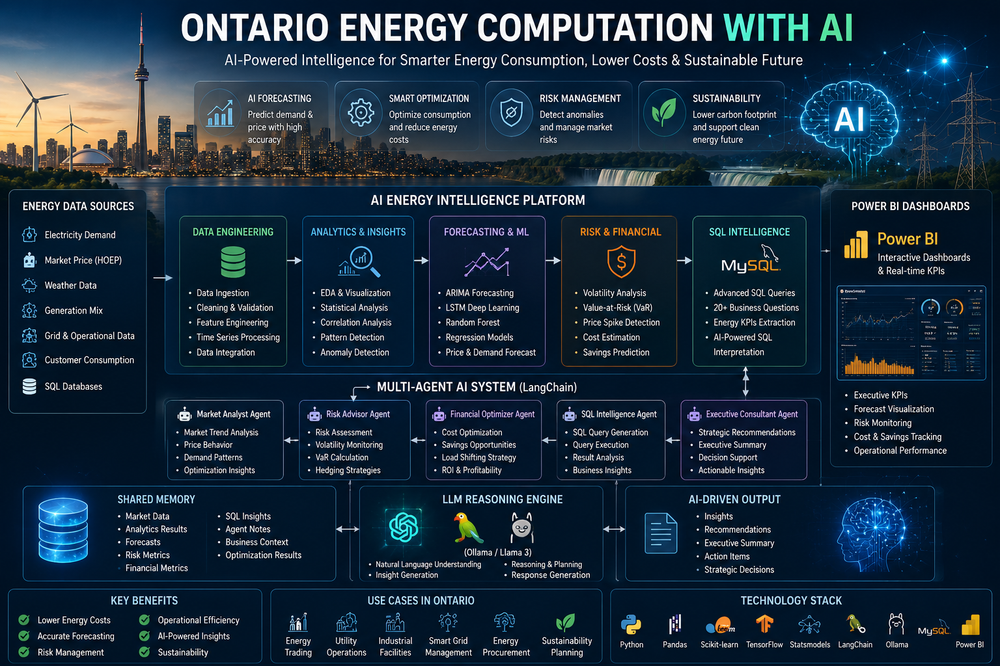
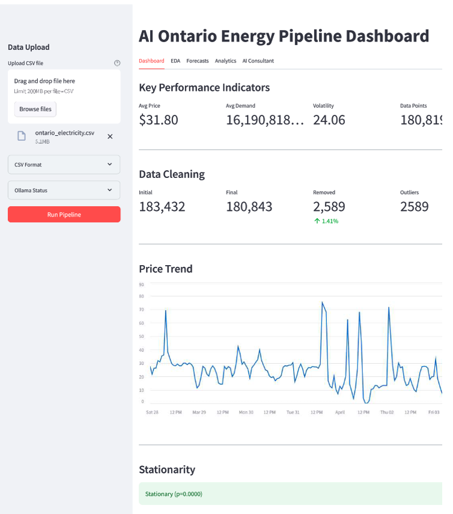
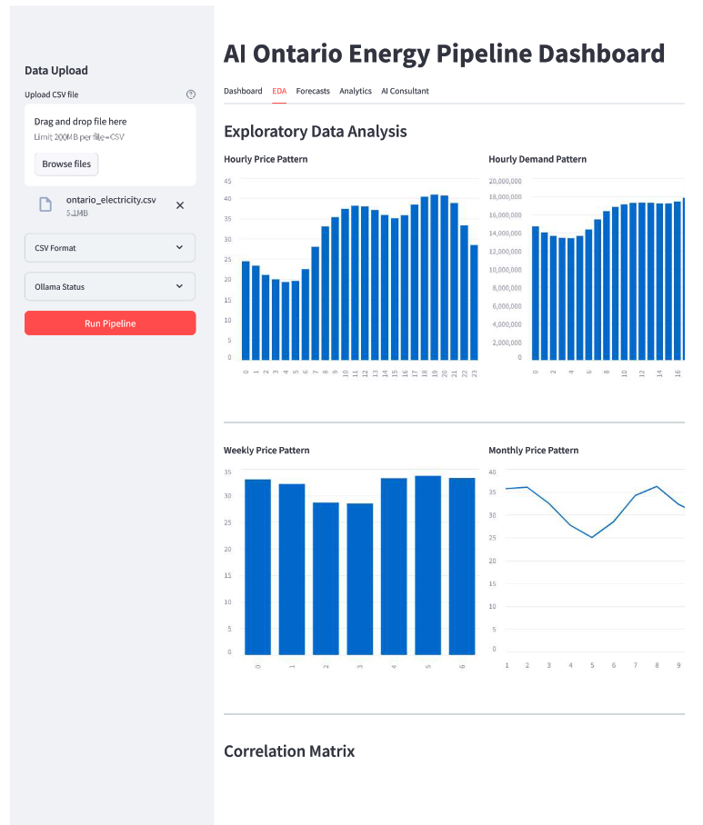
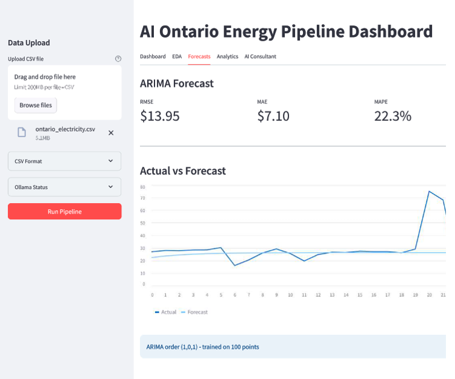
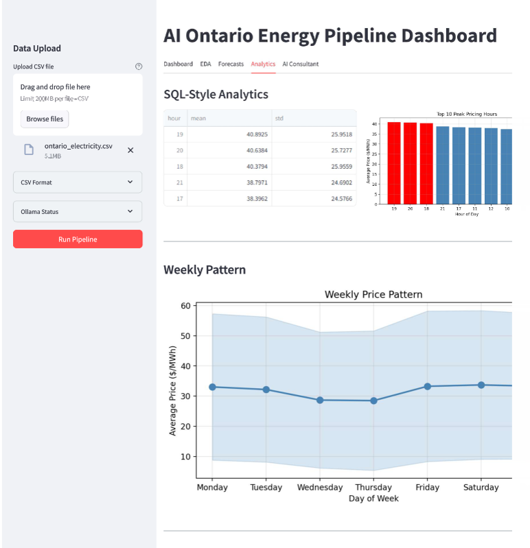
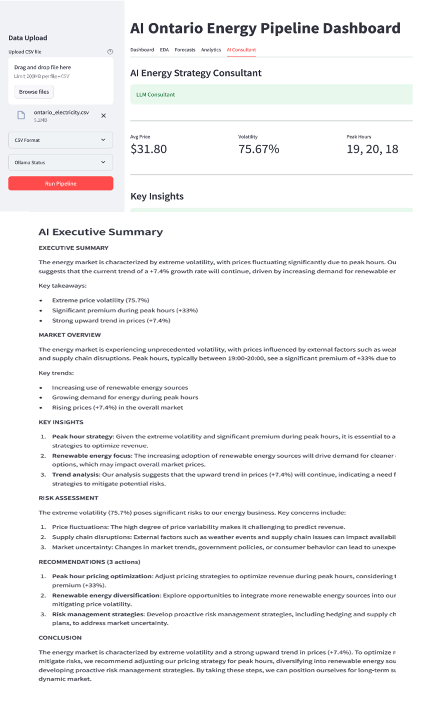

<h1 align="center"> AI Ontario Energy Intelligence Dashboard</h1>

<h2 align="center">
AI-Powered Energy Price Forecasting, Streamlit Energy Analytics & Executive Decision Intelligence Platform
</h2>

An end-to-end energy analytics platform that transforms raw hourly electricity market data 
into forecasting insights, operational recommendations, and AI-generated executive reports.

<h3 align="center">🎥 Project Demo Video</h3>

Click the image above to watch the full dashboard demonstration.

 Streamlit Dashboard |  Time-Series Forecasting |  LLM Energy Consultant |  Business Analytics

<h2> Project Story: From Raw Energy Data to Strategic Decisions</h2>

Electricity markets generate massive volumes of hourly data, but transforming that data into strategic business decisions remains a challenge.

To address this, I developed an AI-Powered Energy Intelligence Platform that integrates Data Engineering, Time-Series Forecasting, Business Intelligence Analytics, and an AI Agent into a unified decision-support system. The platform automates ETL, feature engineering, anomaly detection, electricity price forecasting, business KPI analysis, and an AI-powered Energy Consultant that leverages Llama 3.2 (Ollama) with a function-based orchestration pipeline to generate executive-ready insights and actionable recommendations. The result is a platform that transforms raw hourly electricity market data into decision intelligence for price forecasting, risk assessment, and operational optimization.

This dataset contains hourly Ontario electricity market data from <strong>2003–2023</strong>, provided by the
<a href="https://www.ieso.ca/market-data" target="_blank">Independent Electricity System Operator (IESO)</a>.
It includes electricity demand and market price information used for energy consumption analysis,
price forecasting, and electricity market intelligence.

<h3>Key Fields</h3>

<ul>
  <li><strong>Date & Hour:</strong> Hourly timestamp (EST).</li>
  <li><strong>Hourly_Demand (kWh):</strong> Total provincial electricity demand.</li>
  <li><strong>Average_Hourly_Price (¢/kWh):</strong> Hourly Ontario Energy Price (HOEP), calculated as the weighted average of twelve 5-minute market clearing prices within each hour.</li>
</ul>

<h2> Business Problem I Solved</h2>

Energy organizations often have access to large volumes of operational data,
but the challenge is converting this information into timely decisions.

<table>

<tr>
<th>Business Challenge</th>
<th>Impact</th>
<th>Solution Developed</th>
</tr>

<tr>
<td>Electricity price volatility</td>
<td>Unexpected operational costs</td>
<td>Forecasting and volatility analysis</td>
</tr>

<tr>
<td>Peak pricing exposure</td>
<td>Higher electricity expenses</td>
<td>Peak hour identification</td>
</tr>

<tr>
<td>Complex time-series behavior</td>
<td>Difficult manual interpretation</td>
<td>Automated analytics pipeline</td>
</tr>

<tr>
<td>Data without business context</td>
<td>Slow decision making</td>
<td>LLM-generated executive recommendations</td>
</tr>

</table>

<h2> Solution Approach</h2>

I designed a hybrid AI architecture combining analytical models with generative AI.
The objective was not only to predict prices, but also to explain what those predictions
mean from a business perspective.

<h3>1. Data Science Layer</h3>

 Data set is cime from real data of  ontarion , http : 

<ul>

<li>Data cleaning and validation</li>
<li>Feature engineering from hourly energy patterns</li>
<li>Statistical market analysis</li>
<li>Anomaly detection</li>

</ul>

<h3>2. Forecasting Layer</h3>

<ul>

<li>ARIMA time-series forecasting</li>
<li>24-hour electricity price prediction</li>
<li>Forecast evaluation using RMSE, MAE, and MAPE</li>

</ul>

<h3>3. AI Decision Layer</h3>

<ul>

<li>Llama 3.2 LLM integration through Ollama & function calling </li>
<li>Prompt engineering using analytical results</li>
<li>Automated executive energy strategy reports</li>
</ul>

##  Streamlit Sections 

###  **Dashboard Tab**
- Real-time KPIs (average price, demand, volatility)
- Interactive price/demand trend charts
- Stationarity test results (ADF p-value)

###  **EDA Tab**
- Hourly, weekly, and monthly price patterns
- Correlation heatmap (price vs. demand vs. time features)
- Anomaly detection (z-score > 3)

###  **Forecasts Tab**
- ARIMA vs. LSTM side-by-side comparison
- RMSE, MAE, MAPE metrics for model evaluation
- Visual forecast vs. actual charts
- Model performance recommendations

###  **Analytics Tab**
- Top 10 peak pricing hours
- Weekly price patterns (Monday–Sunday)
- Monthly min/max/mean prices
- Most volatile hours for risk management

###  **AI Consultant Tab**
- Executive summary (3-4 lines)
- Market overview with specific numbers
- Risk assessment with severity levels
- 3 optimization opportunities with estimated savings
- Prioritized strategic recommendations (1-4)
- Fallback mode if LLM unavailable

---

<h2> Functional Calling Architecture</h2>

The project follows a modular software design where every analytical operation
is separated into an independent reusable function.

The design principle is:

<h3 align="center">

One Function → One Responsibility → One Analytical Task

</h3>

<h2> End-to-End Pipeline Architecture</h2>

<pre>

                 Raw Energy CSV Dataset

                          |
                          ▼

                    load_data()

        Data ingestion & datetime transformation

                          |
                          ▼

                    clean_data()

      Missing values | duplicates | outlier handling

                          |
                          ▼

              feature_engineering()

   Lag variables | rolling averages | volatility

                          |
                          ▼

          statistical_summary()

        Market descriptive statistics

                          |
                          ▼

              eda_analysis()

   Price patterns | demand patterns |
   correlations | anomaly detection

                          |
                          ▼

          check_stationarity()

          ADF time-series validation

                          |
                          ▼

          fast_arima_forecast()

          24-hour electricity forecast

                          |
                          ▼

             sql_analytics()

       Business intelligence analytics

                          |
                          ▼

             ai_consultant()

      LLM-powered strategy generation

                          |
                          ▼

           Streamlit Decision Dashboard

</pre>

<h2> Functional Modules Implemented</h2>

<h3>1. Data Loading Function</h3>

<pre>
load_data(file)
</pre>

Transforms raw CSV files into structured time-series data by creating a datetime index
from date and hourly information.

<strong>Responsibilities:</strong>

<ul>

<li>Read energy market data</li>
<li>Create chronological datetime index</li>
<li>Prepare dataset for forecasting</li>

</ul>

<h3>2. Data Cleaning Function</h3>

<pre>
clean_data(df)
</pre>

Improves data reliability before analytics and modeling.

<ul>

<li>Duplicate removal</li>
<li>Missing value interpolation</li>
<li>Numeric conversion</li>
<li>Z-score anomaly filtering</li>
<li>Cleaning quality report generation</li>

</ul>

<h3>3. Feature Engineering Function</h3>

<pre>
feature_engineering(df)
</pre>

Creates predictive variables that capture electricity market behavior.

<table>

<tr>
<th>Feature</th>
<th>Business Meaning</th>
</tr>

<tr>
<td>Hour</td>
<td>Daily consumption pattern</td>
</tr>

<tr>
<td>Weekend Flag</td>
<td>Operational difference</td>
</tr>

<tr>
<td>24h Lag Price</td>
<td>Previous day market behavior</td>
</tr>

<tr>
<td>Rolling Price</td>
<td>Short-term market trend</td>
</tr>

<tr>
<td>Volatility Index</td>
<td>Financial risk indicator</td>
</tr>

</table>

<h2> Forecasting Engine</h2>

<h3>ARIMA Time-Series Model</h3>

<pre>
fast_arima_forecast(df)

ARIMA(1,0,1)

</pre>

The forecasting module learns historical electricity price behavior and predicts
future market conditions.

<strong>Evaluation Metrics:</strong>

<ul>

<li>RMSE</li>

<li>MAE</li>

<li>MAPE</li>

</ul>

<h2> AI Energy Consultant (LLM Integration)</h2>

<h3>Main Function</h3>

<pre>
ai_consultant(df, sql_result, arima_result)
</pre>

The AI consultant converts analytical outputs into an executive-level energy report.

<h3>AI Workflow</h3>

<pre>

Analytics Results

        ↓

Business Metric Extraction

        ↓

Prompt Engineering

        ↓

Llama 3.2 (Ollama)

        ↓

Energy Strategy Report

</pre>

<h3>AI Understands:</h3>

<ul>

<li>Average electricity price</li>
<li>Market volatility</li>
<li>Peak pricing hours</li>
<li>Weekend price differences</li>
<li>Demand-price correlation</li>
<li>Price trends</li>

</ul>

<h3>Generated Report:</h3>

<ul>
<li>Executive Summary</li>
<li>Market Overview</li>
<li>Risk Assessment</li>
<li>Operational Recommendations</li>
<li>Strategic Conclusion</li>

</ul>

<h2> Pipeline Orchestration</h2>

The entire analytical workflow is controlled by a central pipeline orchestrator.

<pre><code>

run_pipeline(file) +Function calling

    ↓

load_data()

    ↓

clean_data()

    ↓

feature_engineering()

    ↓

statistical_summary()

    ↓

eda_analysis()

    ↓

check_stationarity()

    ↓

fast_arima_forecast()

    ↓

sql_analytics()

    ↓

ai_consultant()

    ↓

Return Complete Intelligence Package

</code></pre>

<h2> Interactive Streamlit Dashboard</h2>

<table>

<tr>
<th>Dashboard Section</th>
<th>Purpose</th>
</tr>

<tr>
<td>Dashboard</td>
<td>KPI monitoring, price trends, data quality</td>
</tr>

<tr>
<td>EDA</td>
<td>Market behavior discovery</td>
</tr>

<tr>
<td>Forecast</td>
<td>ARIMA prediction performance</td>
</tr>

<tr>
<td>Analytics</td>
<td>Business intelligence insights</td>
</tr>

<tr>
<td>AI Consultant</td>
<td>LLM-generated strategy report</td>
</tr>

</table>

<h2> Technologies & Skills Demonstrated</h2>

<table>

<tr>
<th>Area</th>
<th>Technology</th>
</tr>

<tr>
<td>Programming</td>
<td>Python, Pandas, NumPy</td>
</tr>

<tr>
<td>Data Science</td>
<td>EDA, Statistics, Feature Engineering</td>
</tr>

<tr>
<td>Forecasting</td>
<td>ARIMA, Time-Series Analysis</td>
</tr>

<tr>
<td>Visualization</td>
<td>Matplotlib, Seaborn, Streamlit</td>
</tr>

<tr>
<td>Generative AI</td>
<td>Ollama, Llama 3.2, Prompt Engineering</td>
</tr>

<tr>
<td>Software Architecture</td>
<td>Functional Programming, Pipeline Orchestration</td>
</tr>

</table>

<h2> Project Impact</h2>

This project demonstrates how energy data can be transformed from raw operational
records into an intelligent decision-support system.

<ul>
<li>Automated energy analytics workflow</li>
<li>Forecast-driven operational planning</li>
<li>Reduced manual analysis effort</li>
<li>AI-assisted strategic decision making</li>
<li>Reusable architecture for energy analytics applications</li>
</ul>
